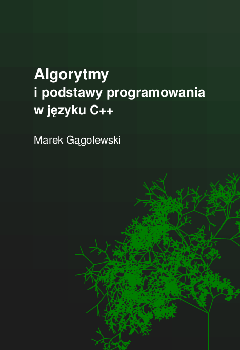

# Algorytmy i podstawy programowania w języku C++ (in Polish)

[M. Gągolewski](https://www.gagolewski.com),
[Algorytmy i podstawy programowania w języku C++](aipp.pdf),
Zenodo, Melbourne, 2022, 209 s.,
DOI:[10.5281/zenodo.6451054](https://dx.doi.org/10.5281/zenodo.6451054),
ISBN: 978-0-6455719-0-5.

[Oto](aipp.pdf) skrypt do wykładu z Algorytmów i podstaw programowania
w języku C++, który prowadziłem w latach 2010–2016 na
[Wydziale Matematyki i Nauk Informacyjnych](http://www.mini.pw.edu.pl)
Politechniki Warszawskiej.
Słuchaczami byli głównie studenci I roku kierunku Matematyka.

Zawiera wiele przykładowych zadań na ćwiczenia i laboratoria.

Książka jest dystrybuowana oczywiście bezpłatnie.
Ze względu na ciągłe zainteresowanie tą publikacją, jej treść
odświeżyłem w 2022 r.

Powodzenia. :)
